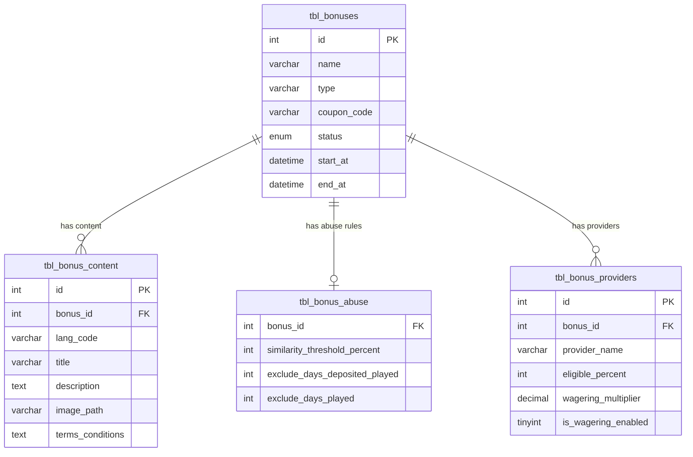
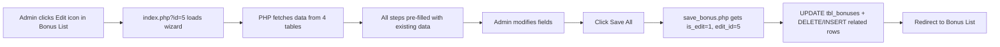
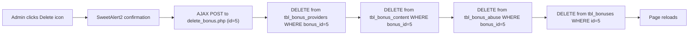

# Bonus Management System — Complete Documentation

## 📁 File Structure

```
admin/manage-bonus/
├── index.php                          ← Redirect/landing page
├── bonus-list/
│   ├── index.php                      ← Lists all bonuses (search, edit, delete)
│   └── delete_bonus.php               ← AJAX handler to delete a bonus
├── create-bonus/
│   ├── index.php                      ← Main wizard page (Create + Edit)
│   ├── save_bonus.php                 ← AJAX handler to save/update a bonus
│   ├── steps/
│   │   ├── step1.php                  ← General Info
│   │   ├── step2.php                  ← Redemption Rules
│   │   ├── step3.php                  ← Coupon Sets (Content)
│   │   ├── step4.php                  ← Abuse Control
│   │   └── step5.php                  ← Wagering Conditions
│   ├── check_schema.php               ← [Temp] DB schema checker
│   ├── check_all_tables.php           ← [Temp] All tables checker
│   ├── migrate_db.php                 ← [Temp] Migration script
│   └── update_abuse_schema.php        ← [Temp] Abuse table migration
└── explore-bonus/
    └── index.php                      ← Bonus preview/explore page
```

> [!TIP]
> Files marked `[Temp]` are one-time utility scripts used during development. They can be safely deleted.

---

## 🗄️ Database Design

### Table: `tbl_bonuses` (Main)

This is the **central table** storing all bonus configuration.

| Column | Type | Description |
|--------|------|-------------|
| `id` | int(11) PK | Auto-increment ID |
| `name` | varchar(255) | Bonus display name |
| `type` | varchar(50) | `mass`, `single_account`, `single_use_cashback`, `redeposit_bonus`, `multiple_account` |
| `coupon_code` | varchar(100) | Fixed promo code (optional) |
| `status` | enum | `active` or `inactive` |
| `is_published` | tinyint(1) | Whether bonus is visible to players |
| `is_public` | tinyint(1) | Whether bonus appears in public listing |
| `comment` | text | Internal admin notes |
| `redemption_type` | varchar(50) | `percent_deposit`, `fixed_deposit`, `fixed_redemption`, `cashback_bonus`, `referral_bonus` |
| `amount` | decimal(10,2) | Bonus amount or percentage |
| `bonus_category` | varchar(50) | `casino`, `sports`, `casino_sports` |
| `payment_methods` | varchar(255) | `all`, `upi`, `crypto`, `bank` |
| `min_deposit` | decimal(10,2) | Minimum deposit to trigger bonus |
| `max_redeem_value` | decimal(10,2) | Cap on bonus value |
| `is_first_deposit` | tinyint(1) | Only on 1st deposit |
| `is_second_deposit` | tinyint(1) | Only on 2nd deposit |
| `is_third_deposit` | tinyint(1) | Only on 3rd deposit |
| `is_new_player_only` | tinyint(1) | Restrict to new players |
| `is_auto_redeem` | tinyint(1) | Auto-apply on login |
| `allow_download` | tinyint(1) | Redeemable from download client |
| `allow_instant` | tinyint(1) | Redeemable from instant play |
| `allow_mobile` | tinyint(1) | Redeemable from mobile |
| `start_at` | datetime | Bonus validity start |
| `end_at` | datetime | Bonus validity end |
| `redemption_pattern` | text | JSON — per-day schedule (see below) |
| `player_limit_type` | varchar(50) | `daily`, `alternate`, `weekly` |
| `limit_daily` | int | Max uses per player per day |
| `limit_weekly` | int | Max uses per player per week |
| `limit_monthly` | int | Max uses per player per month |
| `limit_total` | int | Absolute max total redemptions |
| `created_at` | timestamp | Auto-set on creation |

### Table: `tbl_bonus_content` (Multi-language Content)

| Column | Type | Description |
|--------|------|-------------|
| `id` | int(11) PK | Auto-increment |
| `bonus_id` | int(11) FK | → `tbl_bonuses.id` |
| `lang_code` | varchar(10) | Language code (e.g., [en](file:///d:/xampp/htdocs/api/admin/dashboard/index.php#54-57)) |
| `title` | varchar(255) | Player-facing bonus title |
| `description` | text | Player-facing description |
| `image_path` | varchar(255) | Path to uploaded banner image |
| `terms_conditions` | text | Legal terms & conditions |

### Table: `tbl_bonus_abuse` (Anti-Fraud Settings)

| Column | Type | Description |
|--------|------|-------------|
| `bonus_id` | int(11) FK | → `tbl_bonuses.id` |
| `similarity_threshold_percent` | int | Block if player similarity > X% |
| `exclude_days_deposited_played` | int | Exclude players who deposited + played in last X days |
| `exclude_days_played` | int | Exclude players who played in last X days |

### Table: `tbl_bonus_providers` (Per-Provider Wagering)

| Column | Type | Description |
|--------|------|-------------|
| `id` | int(11) PK | Auto-increment |
| `bonus_id` | int(11) FK | → `tbl_bonuses.id` |
| `provider_name` | varchar(100) | e.g., `Evolution`, `Jili`, `All` |
| `eligible_percent` | int | % of bets counting toward wagering |
| `wagering_multiplier` | decimal(5,2) | Times bonus must be wagered |
| `is_wagering_enabled` | tinyint(1) | Whether this provider counts |

---

## 🔗 Database Relationships



---

## ⚙️ How It Works — Full Flow

### 1. Creating a Bonus

```mermaid
flowchart LR
    A[Admin clicks Create Bonus] --> B[index.php loads empty wizard]
    B --> C[Step 1: General Info]
    C --> D[Step 2: Redemption Rules]
    D --> E[Step 3: Coupon Sets / Content]
    E --> F[Step 4: Abuse Control]
    F --> G[Step 5: Wagering Conditions]
    G --> H[Click Save All]
    H --> I[AJAX POST to save_bonus.php]
    I --> J[INSERT into 4 tables]
    J --> K[Redirect to Bonus List]
```



**Detailed steps:**

1. Admin opens [create-bonus/index.php](file:///d:/xampp/htdocs/admin/manage-bonus/create-bonus/index.php)
2. PHP sets `$is_edit = false`, all form fields show empty/default values
3. All 5 steps are inside **one single `<form id="bonusForm">`**
4. Admin fills in data across all 5 steps using **Next/Previous** navigation
5. On Step 5, clicks **Save All**
6. jQuery serializes the entire form via `new FormData(this)` and sends AJAX POST to [save_bonus.php](file:///d:/xampp/htdocs/admin/manage-bonus/create-bonus/save_bonus.php)
7. [save_bonus.php](file:///d:/xampp/htdocs/admin/manage-bonus/create-bonus/save_bonus.php) processes the data:
   - Inserts into `tbl_bonuses` → gets `$bonus_id`
   - Inserts into `tbl_bonus_content` (title, description, image, terms)
   - Inserts into `tbl_bonus_abuse` (similarity threshold, exclusion days)
   - Inserts into `tbl_bonus_providers` (per-provider wagering config)
8. Returns `{"status": "success"}` → SweetAlert shows success → redirects to bonus list

### 2. Editing a Bonus



**How pre-filling works:**

- [index.php](file:///d:/xampp/htdocs/admin/index.php) detects `$_GET['id']` → sets `$is_edit = true`
- Fetches from all 4 tables into: `$bonus_data`, `$bonus_content`, `$bonus_abuse`, `$bonus_providers`
- Each step file uses ternary operators:
  ```php
  value="<?php echo $is_edit ? $bonus_data['name'] : ''; ?>"
  ```

### 3. Deleting a Bonus



### 4. Viewing Bonus List

- [bonus-list/index.php](file:///d:/xampp/htdocs/admin/manage-bonus/bonus-list/index.php) runs a SELECT query on `tbl_bonuses`
- Supports **search filter** across: coupon code, name, type, redemption type
- Each row shows: Name, Type, Coupon Code, Amount, Status, Edit/Delete actions
- Edit button links to `../create-bonus/?id=X`

---

## 🔐 Security & Access Control

Every page follows the same pattern:
```php
define("ACCESS_SECURITY", "true");       // Required to include config.php
include '../../../security/config.php';   // DB connection
include '../../../security/constants.php';// App constants
include '../../access_validate.php';      // Access control class

session_start();
$accessObj = new AccessValidate();
if ($accessObj->validate() == "true") {
    if ($accessObj->isAllowed("access_gift") == "false") {
        echo "You're not allowed to view this page.";
        return;
    }
} else {
    header('location:../../logout-account');
}
```

- `ACCESS_SECURITY` constant prevents direct access to [config.php](file:///d:/xampp/htdocs/security/config.php)
- `AccessValidate` checks admin session and permission `access_gift`
- Unauthorized users are redirected to logout

---

## 📦 `redemption_pattern` JSON Format

The scheduling pattern is stored as JSON in `tbl_bonuses.redemption_pattern`:
```json
{
    "Mon": { "start": "09:00", "end": "18:00" },
    "Wed": { "start": "10:00", "end": "20:00" },
    "Fri": { "start": "00:00", "end": "23:59" }
}
```
Only checked days are stored. Unchecked days are absent from the object.

---

## 🧩 How the Wizard Navigation Works

The 5-step wizard uses a single-page approach:
- All 5 step content divs exist in the DOM simultaneously
- Only one is visible at a time (`display: none` vs `display: block`)
- Navigation is handled purely by JavaScript (jQuery)
- Sidebar clicks, Next buttons, and Previous buttons all call `goToStep(n)`
- No page reloads during navigation — only on Save/Cancel
